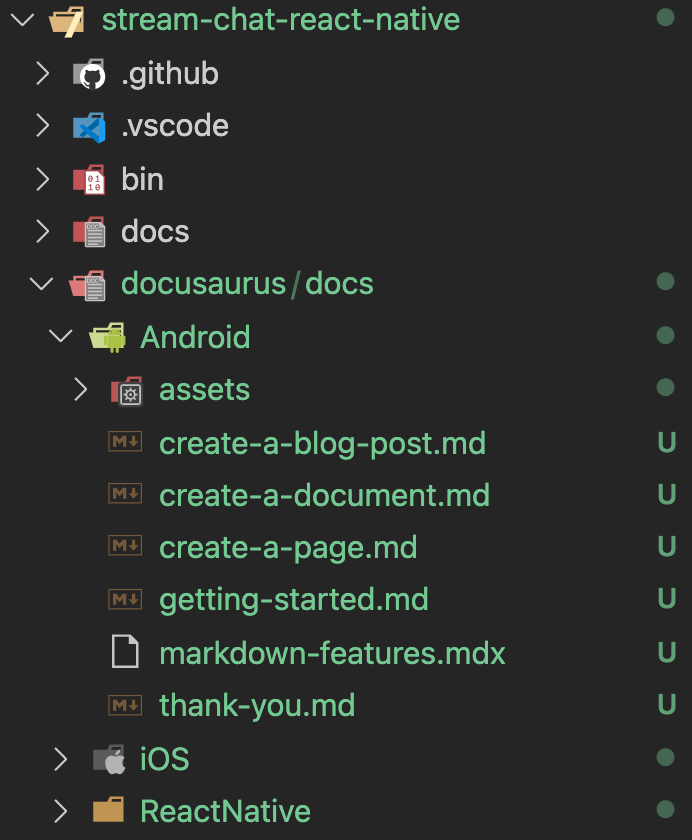
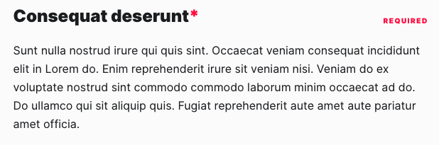
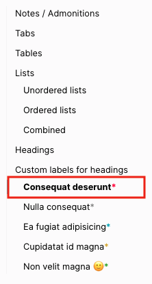
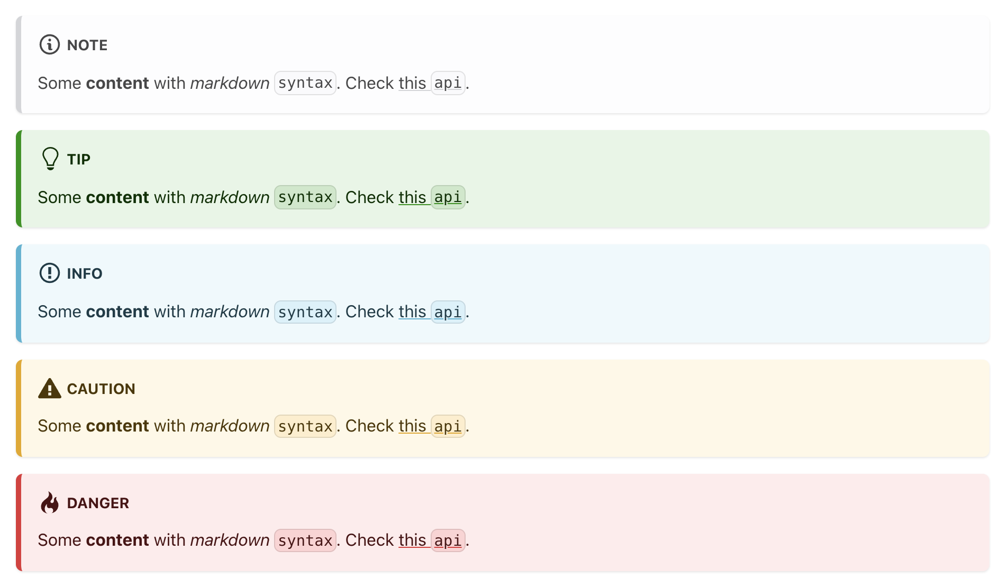
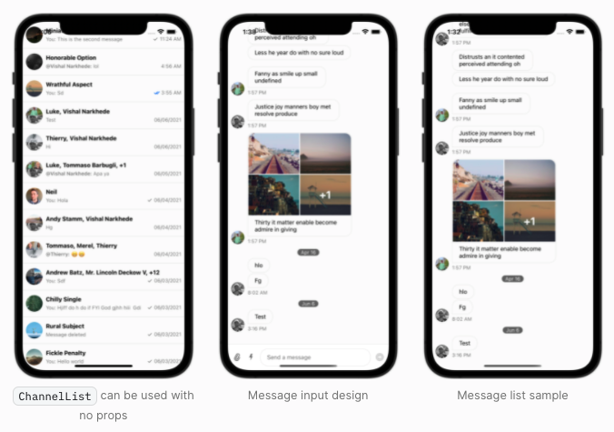

# Stream Chat Docusaurus CLI

This is a CLI tool to help locally run docusaurus and show SDK documentation

## Local SDK setup

You should have a documentation directory structure starting from a `docusaurus` directory in your SDK. Within that there should be a `docs` directory. Within that should be a directory named for your SDK (ex: `iOS` or `Android` or `ReactNative`). All of your markdown documentation should live within that directory and you can feel free to use any additional directory structure you see fit for sectioning your docs. Note: each directory you have will become it's own url path. For instance, if you have this `docusaurus/docs/Android/classes/some-doc.md` file path then the url path for that markdown file will be `{url}/chat/docs/sdk/android/classes/some-doc`. Below is an example of this directory structure. Locally you should only need your individual SDK directory and contents.



The markdown file which you want to be the starting page (ex: `{url}/chat/docs/sdk/android` or `{url}/chat/docs/sdk/ios`) for your SDK docs should have this at the top of the file and be in the root of your doc SDK directory (ex: `docusaurus/docs/Android/example.md` or `docusaurus/docs/iOS/example.md`):

```
---
slug: /
---
```

### Assets

You can add local assets to your docs by adding them within an `assets` folder within your SDK named directory (ex: `docusaurus/docs/Android/assets/some-asset.png`) and then utilize them through local paths within your markdown files. For more info, reference the docusaurus documentation [here](https://docusaurus.io/docs/markdown-features/assets).

## Plugins

You can add your own plugins in addition to the default set by creating a `docusaurus{SDK_NAME}.plugin.js` file within your `docusaurus` directory.

The custom plugin file (example name: `docusaurusReact.plugin.js`) should be in a format like this where you can add multiple plugins. `cwd` is the root path to your SDK (outside of the `docusaurus` directory described in [Local SDK setup](#Local-SDK-setup))
```js
const cwd = process.env.STREAM_SDK_PATH;
module.exports = () => {
  return {
    plugins: [
      [
        path.join(cwd, "docusaurus/node_modules/docusaurus-plugin-typedoc"),

        {
          entryPoints: [path.join(cwd, "docusaurus/src/index.ts")],
          tsconfig: path.join(cwd, "docusaurus/tsconfig.json"),
          docsRoot: path.join(cwd, "docusaurus/docs"),
          out: "docusaurus/api",
          sidebar: {
            sidebarFile: path.join(cwd, "docusaurus/typedoc-sidebar.js"),
            fullNames: false,
          },
        },
      ],
    ],
  };
};
```

### SDK-specific config for `@docusaurus/plugin-content-docs`

We have common configuration of docusaurus docs in `docusaurus/docusaurus.config.js`. To modify the configuration, you can create a plugin file in your docusaurus directory as described above, with one of the plugins using `@docusaurus/plugin-content-docs` as the plugin ID.

The object defined for the plugin will be merged with the default configuration.

For example for React Native, there is a file at `/docusaurus/reactnative-docusaurus-content-docs.plugin.js` with the following content:

``` js
module.exports = {
  plugins: [
    [
      '@docusaurus/plugin-content-docs',
      {
        lastVersion: "3.x.x",
        versions: {
          current: {
            label: '4.0.0',
            banner: 'unreleased',
            path: '4.0.0'
          },
          '3.x.x': {
            label: '3.x.x',
          }
        }
      }
    ]
  ]
}
```

## Sidebars

You can add your own sidebar instead of the auto-generated default by creating a `sidebars-{SDK_NAME}.(js|json)` file within your `docusaurus` directory. For example on `React` the file would be `sidebars-react.(js|json)` and for `React Native` you would do `sidebars-react-native.(js|json)`.

## Installation and Using the CLI
 
`yarn global add stream-chat-docusaurus-cli` or `npm install -g stream-chat-docusaurus-cli`

Within the same directory level of your SDK that the `docusaurus` directory described above lives you can run CLI commands. Make sure you have at least the directory structure described above as well as at least 1 markdown file.

*Haven't published yet so this won't install from npm/yarn so instead you can clone this locally and navigate to this folder and just do `npm install -g`*

### Initializing

To initialize the docusaurus setup (which you will need to always do before anything else), you can utilize `npx` and run this command `npx stream-chat-docusaurus -i`. If there are any custom packages you need to install for custom plugin setups you can utilize the `-c` option and add a comma separated list of packages that will be installed on initialization (ex: `npx stream-chat-docusaurus -i -c=docusaurus-plugin-typedoc,typedoc,typedoc-plugin-markdown,typescript`).

### Starting

To locally run the docusaurus setup and see your documentation you can run `npx stream-chat-docusaurus -s`. This command can be chained with the `-i` initialization command in 1 step by running `npx stream-chat-docusaurus -i -s`.

### Environment variables

In order to run the searching functionality, you need to add the Algolia env vars in your `/docusaurus/.env` file. Please remember to add it to `.gitignore` and you can have a list of required variables in our `docusaurus/src/environment.js` file.

### Versioning

To cut a new version of your docs simply type in `npx stream-chat-docusaurus -nv NEW_VERSION SDK_NAME` like this (SDK_NAME all lowercase with no spaces): `npx stream-chat-docusaurus -nv 2.0.0-rc.0 reactnative`.

### Building

To locally build your docusaurus static files to see if it succeeds you should run `npx stream-chat-docusaurus -b`. The `-b` flag builds the static files.

### MDX

Imports for mdx files need to be after the `---` section. For example:

```
---
slug: /
title: Getting Started
---

import Tabs from '@theme/Tabs';
import TabItem from '@theme/TabItem';
```
 
## Markdown Features Stream theme

Aside from [Docusaurus' components](https://docusaurus.io/docs/next/markdown-features/), you can use our customized components.

### Labels in headers

Labels can be used inside headers to give them emphasis. This will add styles in the Header and ToC.

```md
### <div class="label required">required</div> **Consequat deserunt**
```

> NOTE: It is mandatory to put the `label` __before__ your Heading title. See [this](docusaurus/src/css/components/label.scss#L8) for design implementation.



And you will also see the following style in the ToC



#### Types

Similar to [admonitions/notes](https://docusaurus.io/docs/next/markdown-features/admonitions), we defined 5 label types:
  - required
  - note
  - info
  - caution
  - success



### Image Showcase

Component created to display images inside a flex container, fully responsive and interactive (hover the images to slightly expand them) out of the box 🙂

To make use of the `<ImageShowcase />` component, remember to add the correct import at the beginning of your `.mdx` file.

Example of how to use it:

```jsx
import ImageShowcase from '@site/src/components/ImageShowcase';

import channelList from '../assets/channel_list.png'
import messageInput from '../assets/message_input.png'
import messageList from '../assets/message_list.png'

<ImageShowcase items={[
  { image: channelList, caption: <span><code>ChannelList</code> can be used with no props</span>, alt: 'Example of how to use channelList component' },
  { image: messageInput, caption: 'Message input design' },
  { image: messageList, caption: 'Message list sample' }
]} />
```



### Hide page from search

If you're working on a page and want its content to be hidden from our search, you can add the flag `hide_from_search`
to your frontmatter and this file will be ignored during the search indexing:

```jsx
---
slug: /
hide_from_search: true
---
```
