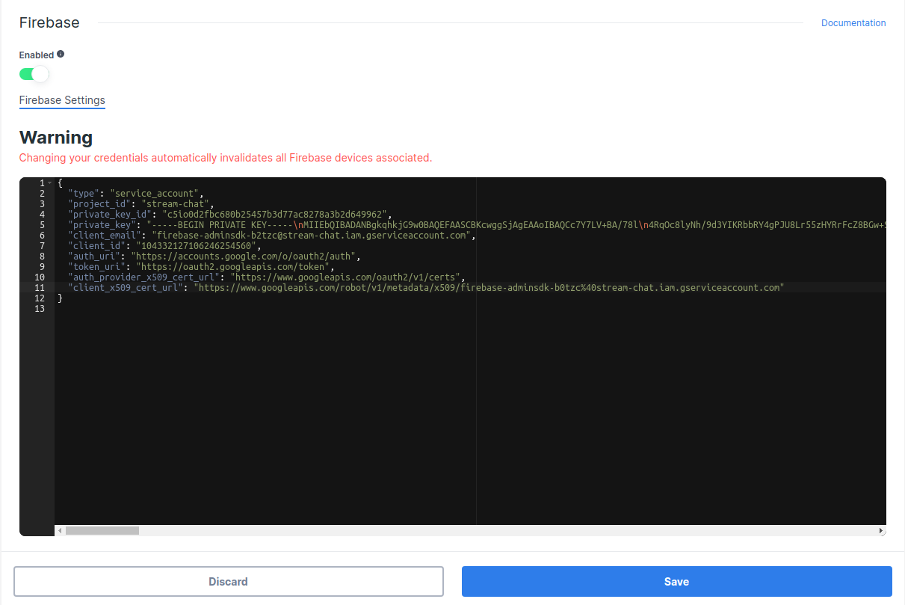

This page shows you how to receive Stream Chat push notifications using [Firebase Cloud Messaging](https://firebase.google.com/docs/cloud-messaging).

## Configuring Notifications on the Stream Dashboard

To be able to receive notifications from Stream, you need to provide your Firebase credentials to Stream.

Go to the [Firebase Console](https://console.firebase.google.com/), and select the project your app belongs to.

:::info
If you don't have a Firebase project yet, you'll have to create a new one.
:::

Click on the gear icon next to **Project Overview** and navigate to **Project settings**:

Navigate to the **Service Accounts** tab. Under **Firebase Admin SDK** section, click on **Generate new private key** button that will generate a _json_ file with the **Firebase Credentials**.

Open the [Stream Dashboard](https://dashboard.getstream.io/). Navigate to the Chat **Overview** page for your app.

Scroll down and enable the **Firebase** switch. Paste the content of the _json_ file with the **Firebase Credentials** that you downloaded during the previous step, and click **Save** to confirm your changes.

That's the server-side setup done. You can now receive push notifications from Stream Chat on the client side. To register devices and process these notifications, follow the steps below.
