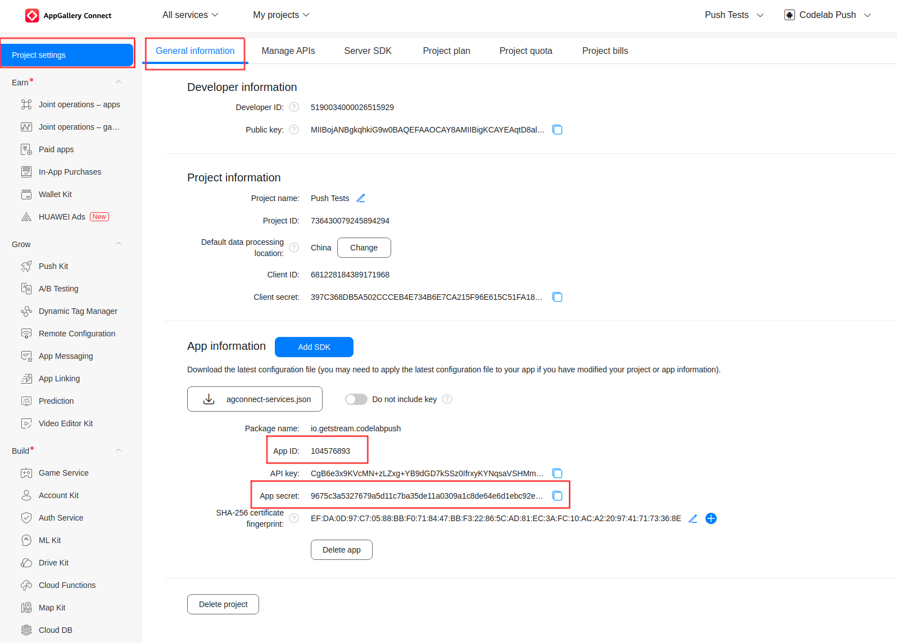
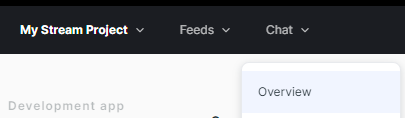
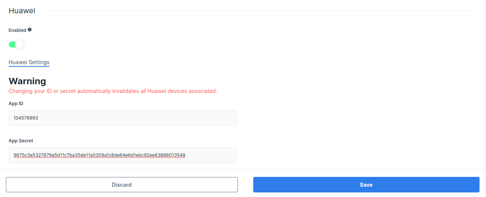

This is the guide for using [Huawei Push Kit](https://developer.huawei.com/consumer/en/hms/huawei-pushkit/) to receive notifications from Stream Chat.

## Configuring Notifications on the Stream Dashboard

To be able to receive notifications from Stream, you need to provide your Huawei credentials to Stream.

Go to the [Huawei Console](https://developer.huawei.com/consumer/cn/service/josp/agc/index.html#/myProject), and select the project your app belongs to.

:::info
If you don't have a Huawei project yet, you'll have to create a new one.
:::

Click on **Project settings** and navigate to the **General information** tab. Under **App Information**, locate the **App ID** and **App secret**, and copy them:

Open the [Stream Dashboard](https://dashboard.getstream.io/). Navigate to the Chat **Overview** page for your app.

Scroll down and enable the **Huawei** switch. Paste your **App ID** and **App secret**, and click **Save** to confirm your changes.

With that, you're done setting up on the dashboard. Next, you need to add the client-side integration.
