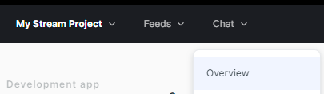

Follow this guide to get push notifications from Stream Chat using [Xiaomi Mi Push](http://mipush.global.xiaomi.com/).

## Setting up Notifications on the Stream Dashboard

First, to get notifications from Stream, you'll need to provide your Xiaomi app details on the Stream dashboard.

Go to the [Xiaomi Console](https://admin.xmpush.xiaomi.com/en/app/nav), and select the project your app belongs to.

:::info
Create a new Xiaomi project here if you don't have one yet.
:::

Click on **App Info** and locate the **App ID** and **App secret**, and copy them (if values are not shown, you need to click **View** button):

Open the [Stream Dashboard](https://dashboard.getstream.io/), and go to the Chat **Overview** page.

Find and select the **Xiaomi** switch. Paste your **App ID** and **App secret**, and click **Save** to confirm your changes.

That's all you need to configure on the dashboard. You can now set up the client-side integration.
