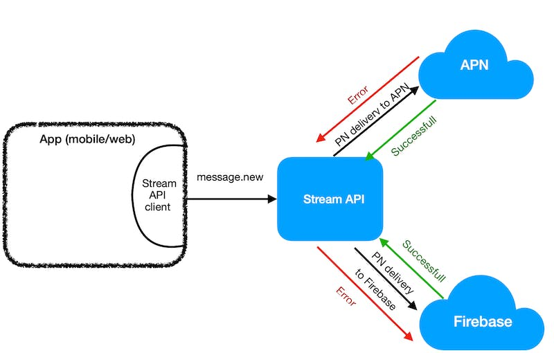
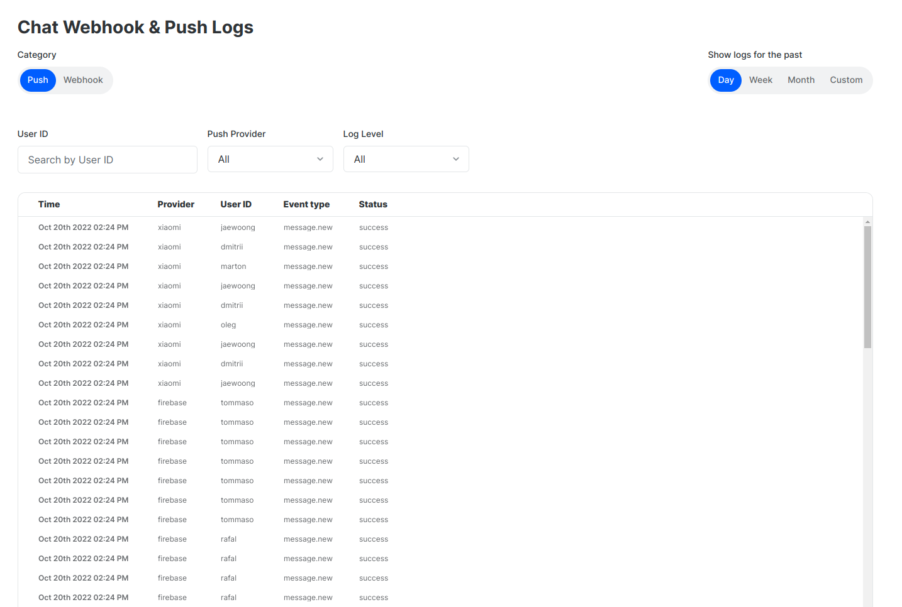
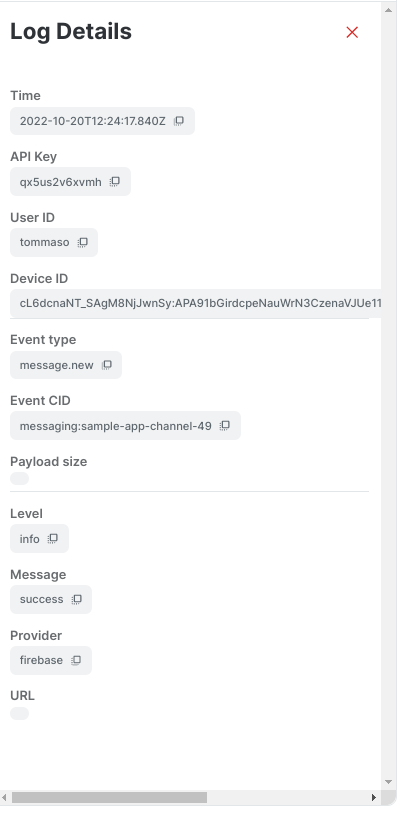

The Stream [Dashboard](https://dashboard.getstream.io/app/APP_ID/chat/webhookpushlogs) includes logs that track the requests sent by Stream Chat API to Firebase or APN.

A new push log is created whenever the Stream API triggers the push delivery service, (i.e triggers the push delivery to provider(s) (Firebase/APN).

The API executes the push notification template and data template to APN or Firebase, and then relies on the provider to deliver the message to the device.

Select Push, and your preferences (Push Provider, Log level, Period):

The Logs include the

- **time** elapsed since the push happened
- **provider** for the push service
- **user ID** of the push receiver
- The **event type** that caused the push
- The **response status** from the provider

:::info
The response status indicates whether the provider received the push and does not indicate whether the user's device successfully received it. If the dashboard shows response statuses and users are reporting failed pushes, the defect is between the Push Provider and the User's device.
:::

When you select a log record, the dashboard shows extra details about the push.

## Log Errors
| STREAM ERROR | Provider error | Description |
| :---: | :---: | :---: |
| NOTREGISTERED - DEVICE IS DISABLED ( 200) | Unregistered Device(200) + error:NotRegistered | Wrong data/parameter |
| BAD DEVICE TOKEN (400) | Authentication Error (401) | The specified device token is invalid. Verify that the request contains a valid token and that the token matches the environment. Common reason - device is registered with wrong token. E.g: iOS device configured with APN toke |
| BAD REQUEST ERROR (400) | Invalid Parameters(400) + | Wrong data/parameter |
| AUTH ERROR (401) | Third Parrty Auth Error (401) | Bad configuration issue. APNs certificate or web push auth key was invalid or missing. |
| UNKNOWN ERROR (403) | Sender ID Mismatch or Internal error | The authenticated sender ID is different from the sender ID for the registration token. | 
| INVALID DEVICE ERROR (404) | Unregistred Device (404) | Device is not registered. |
| RESOURCE EXHAUSTED ERROR (429) | isQuotaExceeded (429) | Quota or limit is reached, resource is exhausted. |
| SOMETHING BAD (500) | Internal Error (500) | An unknown internal error occurred. The server encountered an error while trying to process the request. |

For more details, please refer to the response code documentation for the provider you are using:

- [Firebase](https://firebase.google.com/docs/reference/fcm/rest/v1/ErrorCode)
- [APN](https://developer.apple.com/documentation/usernotifications/setting_up_a_remote_notification_server/handling_notification_responses_from_apns)

