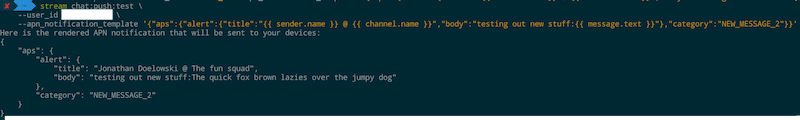

Once you're all set up with push notifications, you can use the [CLI](https://getstream.io/chat/docs/cli/) to test how these notifications will look for your devices.

**Pre-requirements:**

- Your app has push notifications configured for at least one provider in your app settings
- You have a user that has at least one device associated
  - To skip sending to devices but only to see the payload, pass `skip_devices=true`

The base command for testing push notifications is:

```bash
stream chat:push:test --user_id 'user_123'
```

This command provides the following functionality for you:

1. Picks a random message from a channel that this user is part of
2. Uses the notification templates configured for your push provider to render the payload using this message
3. Sends this payload to all of the user's devices

:::info
This particular use case is ideal for testing a newly configured app, to make sure the push notifications are configured exactly as desired.
:::

In some cases, you might want to test the new notification template that you configured on the dashboard.

For example, let's say you want to test a new APN notification template:

```bash
stream chat:push:test --user_id 'user_123' --apn_notification_template '{"aps":{"alert":{"title":"{{ sender.name }} @ {{ channel.name }}","body":"testing out new stuff:{{ message.text }}"},"category":"NEW_MESSAGE_2"}}'
```

As you can see below, the new template will be used for sending the push notification only this time. The existing clients will leverage the default configuration.


## Push Test Parameters

Here's a full list of parameters that you can use with the test command:

|              NAME              |  TYPE   |                                                   DESCRIPTION                                                    | DEFAULT | OPTIONAL |
| :----------------------------: | :-----: | :--------------------------------------------------------------------------------------------------------------: | :-----: | :------: |
|            user_id             | string  |                                                   The user ID                                                    |    -    |          |
|           message_id           | string  | ID of the message that should be used instead of a random one. If the message doesn't exist, an error will occur |    -    |    ✓     |
|   apn_notification_template    | string  |       Notification template to be used instead of the configured APN one. This is one time only. (v1 only)       |    -    |    ✓     |
| firebase_notification_template | string  |       Notification template to be used instead of the configured APN one. This is one time only. (v1 only)       |    -    |    ✓     |
|     firebase_data_template     | string  |        Data template to be used instead of the configured Firebase one. This is one time only. (v1 only)         |    -    |    ✓     |
|          skip_devices          | boolean |                                    Skip requiring device tokens and sending.                                     |  False  |    ✓     |

## Push Test Payload

|            NAME            |       TYPE       |                         DESCRIPTION                          | DEFAULT | OPTIONAL |
| :------------------------: | :--------------: | :----------------------------------------------------------: | :-----: | :------: |
|       device_errors        |      object      |          A map of errors indexed by device tokens.           |    -    |    ✓     |
|       general_errors       | array of strings |         A list of errors encountered with providers.         |    -    |    ✓     |
|        skip_devices        |     boolean      |           Given skip_devices flag is passed back.            |    -    |    ✓     |
|   rendered_apn_template    |      string      |            Your executed APN template (v1 only).             |    -    |    ✓     |
| rendered_firebase_template |      string      |          Your executed Firebase template (v1 only).          |    -    |    ✓     |
|      rendered_message      |      string      | Your payload (v2 for all providers and v1 for Huawei/Xiaomi) |    -    |    ✓     |
