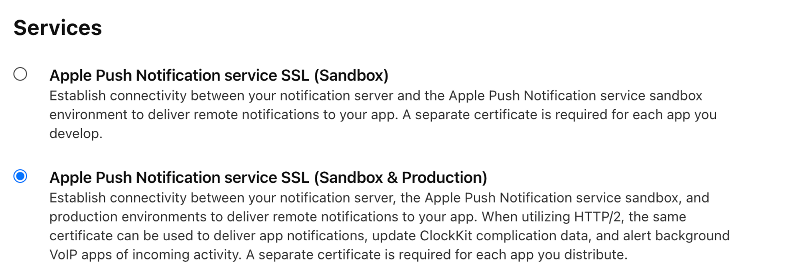
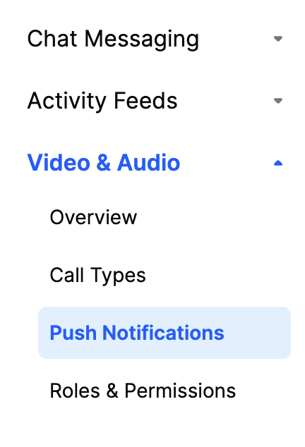
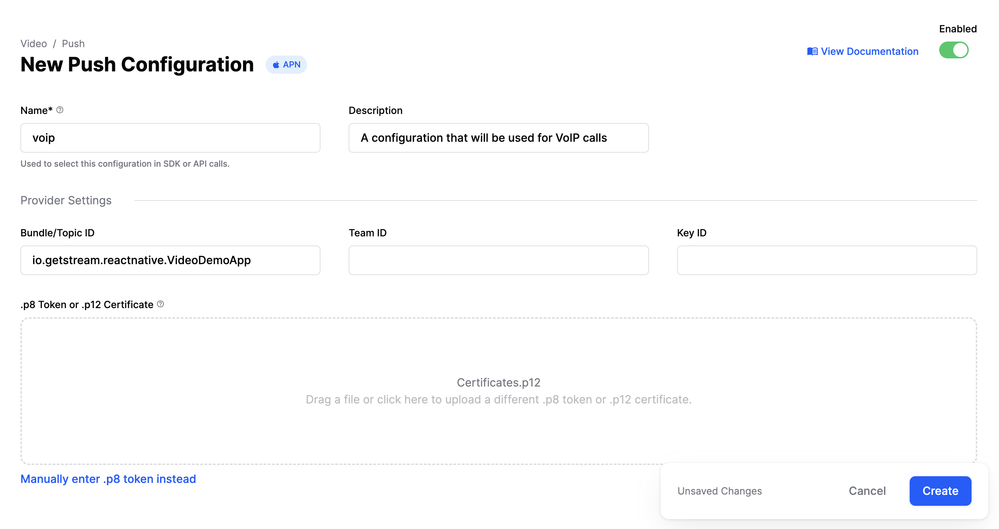

This page shows you how to receive Stream Video push notifications to make VoIP Calls with [CallKit](https://developer.apple.com/documentation/callkit/) using Apple Push Notification service ([APNs](https://developer.apple.com/documentation/usernotifications/registering_your_app_with_apns)).

In order to get started, you would need have a paid Apple developer account, and an app id with push notifications enabled.

## Create VoIP certificate

Next, you need to create a VoIP calling certificate. In order to do that, go to your Apple developer account, select "Certificates, Identifiers & Profiles" and create a new certificate. Make sure to select `"Apple Push Notification service SSL (Sandbox & Production)"`, located under the "Services" section. Follow the steps to create the required certificate.

After you've created the certificate, you would need to convert the `aps.cer` file to a `.p12` certificate file using keychain access and upload it to our dashboard.

:::note
Make sure that you configure no password for the p12 file.
:::

## Dashboard Configuration​

In order to configure VoIP Push Notifications, you need to visit your app's [Stream Dashboard](https://dashboard.getstream.io/) page. From there, select the `Push Notifications` menu option as you can see in the image below:

From there you can create a new configuration by clicking the `New Configuration` button. After selecting the `APN` Provider, you will be asked to provide the following information:

| Field Name | Usage description |
|---|---|
| `Name` | Used to select this configuration in SDK or API calls. |
| `Description` | Allows you to set a description on the configuration to help identify its usage in your app's context. |
| `Bundle/Topic ID` | Your app's bundle id to which the notification will be pushed to. |
| `TeamID` | The Team ID is generated by Apple for your developer account. Can be found in the top right of your Apple developer account. |
| `KeyID` | This is the unique identifier for the p8 authentication key. You can find your Key ID in the keys section of your [Apple developer](https://developer.apple.com/account/) account. |
| `.p8 Token or .p12 Certificate` | The token or certificate that will be used to send the push notification. |

For our example, we are using `voip` as name and we are filling the remaining information as you can see in the image below:

