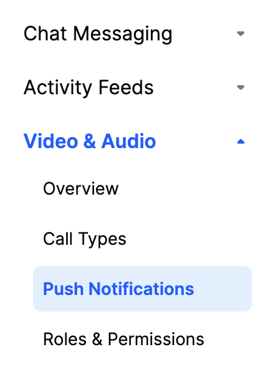

This page shows you how to receive Stream Video push notifications using [Firebase Cloud Messaging](https://firebase.google.com/docs/cloud-messaging).

## Configuring Notifications on the Stream Dashboard

To be able to receive notifications from Stream, you need to provide your Firebase credentials to Stream.

Go to the [Firebase Console](https://console.firebase.google.com/), and select the project your app belongs to.

:::info
If you don't have a Firebase project yet, you'll have to create a new one.
:::

Click on the gear icon next to **Project Overview** and navigate to **Project settings**:

Navigate to the **Service Accounts** tab. Under **Firebase Admin SDK** section, click on **Generate new private key** button that will generate a _json_ file with the **Firebase Credentials**.

Next, you need to visit your app's [Stream Dashboard](https://dashboard.getstream.io/) page. From there, select the `Push Notifications` menu option as you can see in the image below:

From there you can create a new configuration by clicking the `New Configuration` button. After selecting the `Firebase` Provider, you will be asked to provide the following information:

| Field Name         | Usage description                                                                                      |
| ------------------ | ------------------------------------------------------------------------------------------------------ |
| `Name`             | Used to select this configuration in SDK or API calls.                                                 |
| `Description`      | Allows you to set a description on the configuration to help identify its usage in your app's context. |
| `Credentials JSON` | The firebase credentials that will be used to send the push notification.                              |

For our example, we are using `firebase` as name and we are filling the remaining information as you can see in the image below:

